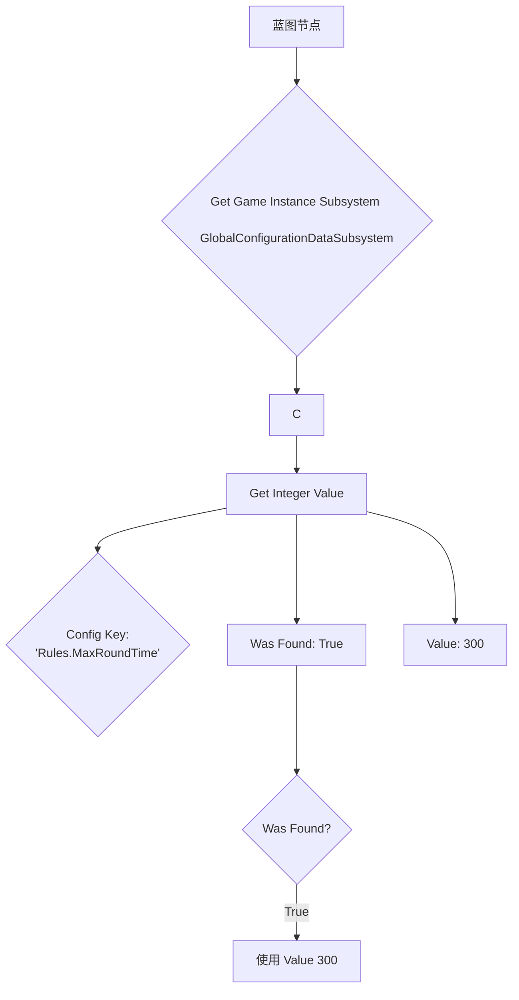

# Global Configuration Data

> A system that is used to query configuration data that can come from many different sources without knowing specifically which one.

| 属性 | 值 |
|---|---|
| 中文名 | 全局配置数据 |
| 分类 | Misc |
| 默认启用 | ✅ 是 |
| 包含内容 | ❌ 无 |
| 模块 | `GlobalConfigurationData` (Runtime), `GlobalConfigurationDataCore` (Runtime) |
| 实验性 | ⚠️ 是 |
| 创建时间 | 2025-06-17 |
| 年龄标签 | 🆕（约 0 年） |
| [源码](https://github.com/EpicGames/UnrealEngine/tree/5.8/Engine/Plugins/Experimental/GlobalConfigurationData) | |

## 用途

这是一个**配置数据抽象层系统**。它解决的核心问题是：游戏或应用中需要获取各种配置数据（如设置、参数、数值表等），但这些数据可能来自不同的地方（例如：本地配置文件、远程服务器、热修复系统、调试命令等）。传统做法是直接在代码中硬编码数据源路径或使用单一配置系统，导致系统耦合度高、难以切换和管理数据源。

`GlobalConfigurationData` 提供了一个**统一的查询接口**，让系统其他部分只需关心“需要什么配置数据”，而无需关心“数据从哪里来”。数据源的具体实现（称为 `Router`）可以灵活配置和替换，实现了**配置数据源与消费逻辑的彻底解耦**。

这个插件为 UE5 提供了一个官方的、可扩展的配置管理基础设施，特别适用于需要支持多种数据源、动态切换数据源（如开发/测试/生产环境）、或进行热修复的大型项目。

## 使用场景

- **多环境配置管理**：你的游戏需要从不同的配置文件（如 `DefaultGame.ini`、服务器下发的配置）中读取相同的设置项（如玩家最大生命值、伤害公式参数）。你可以为每个环境配置不同的 `Router`，而业务代码无需修改。
- **热修复系统**：你需要在不发布客户端补丁的情况下，动态修改某些游戏参数（如活动规则、商店价格）。你可以添加一个从远程服务端拉取配置的 `Router`，并设置为高优先级，使其覆盖本地配置。
- **调试与开发工具**：开发者可能希望通过控制台命令或调试界面临时修改某个配置值。你可以添加一个专门响应控制台命令的 `Router`，这些修改可以立即生效，且不影响其他数据源。
- **A/B 测试或动态功能开关**：需要根据不同的玩家群体加载不同的配置集。你可以实现一个根据玩家ID或设备信息返回不同配置的 `Router`。

## 蓝图用法

### 核心节点

| 节点 | 说明 | 所在类 |
|---|---|---|
| `Get Boolean Value` | 根据配置键名查询布尔值 | `UGlobalConfigurationDataSubsystem` (推断) |
| `Get Integer Value` | 根据配置键名查询整型值 | `UGlobalConfigurationDataSubsystem` (推断) |
| `Get Float Value` | 根据配置键名查询浮点值 | `UGlobalConfigurationDataSubsystem` (推断) |
| `Get String Value` | 根据配置键名查询字符串值 | `UGlobalConfigurationDataSubsystem` (推断) |
| `Get Array Value` | 根据配置键名查询数组值 | `UGlobalConfigurationDataSubsystem` (推断) |

**使用示例（蓝图描述）**：

1.  在任何需要读取配置的地方，使用 `Get Game Instance Subsystem` 节点获取 `GlobalConfigurationDataSubsystem`。
2.  从该子系统实例上，拖引出线，搜索 `Get Boolean Value`、`Get String Value` 等对应类型的函数。
3.  将配置项的键名（例如 `"Game.MaxPlayers"`）连接到函数的 `Config Key` 引脚。
4.  函数会返回一个 `Value` 和一个 `Was Found` 布尔值。先检查 `Was Found` 是否为真，如果为真，则安全地使用 `Value` 进行后续逻辑。



## C++ 用法

### 头文件引入

```cpp
#include "GlobalConfigurationDataSubsystem.h" // 假设的子系统头文件
#include "GlobalConfigurationDataTypes.h"     // 假设的类型定义头文件
```

### 基本用法

从提供的测试用例 `GlobalConfigurationTestData.h` 中，我们可以看到典型的配置值结构，它们可以是基本类型（bool, int32）或数组。

```cpp
// 示例：获取游戏配置中的整数值
if (UGameInstance* GameInstance = GetWorld()->GetGameInstance())
{
    // 获取全局配置子系统
    if (UGlobalConfigurationDataSubsystem* ConfigSubsystem = GameInstance->GetSubsystem<UGlobalConfigurationDataSubsystem>())
    {
        bool bWasFound = false;
        int32 MaxPlayers = ConfigSubsystem->GetIntegerValue(TEXT("Game.MaxPlayers"), bWasFound);
        
        if (bWasFound)
        {
            UE_LOG(LogTemp, Log, TEXT("Max players configured as: %d"), MaxPlayers);
            // 使用 MaxPlayers 进行初始化...
        }
        else
        {
            UE_LOG(LogTemp, Warning, TEXT("Config key 'Game.MaxPlayers' not found, using default."));
            MaxPlayers = 16; // 使用硬编码默认值
        }
    }
}
```
*参考：推断自插件用途及UE常见子系统模式。*

### 进阶用法

该系统很可能支持通过代码注册自定义的 `Router`，从而在运行时动态改变配置数据的来源。

```cpp
// 示例：动态添加一个从JSON文件加载配置的Router
#include "GlobalConfigurationRouter.h"

UCLASS()
class UMyJsonFileRouter : public UGlobalConfigurationRouter
{
    GENERATED_BODY()
public:
    virtual bool GetValue(const FString& Key, FConfigValue& OutValue) override
    {
        // 从本地或远程加载JSON，并从中查找Key对应的值
        // ... 实现细节 ...
        if (bFound)
        {
            OutValue = FConfigValue(FoundValue);
            return true;
        }
        return false;
    }
};

// 在游戏启动时注册
void UMyGameInstance::Init()
{
    Super::Init();
    
    if (UGlobalConfigurationDataSubsystem* Subsystem = GetSubsystem<UGlobalConfigurationDataSubsystem>())
    {
        UMyJsonFileRouter* MyRouter = NewObject<UMyJsonFileRouter>(this);
        // 设置一个较高的优先级，使其覆盖默认的本地配置Router
        Subsystem->AddRouter(MyRouter, 100); 
    }
}
```
*参考：基于插件描述“可以来自许多不同的源”和近期git提交“添加热修复配置路由器”的推断。*

## Demo 示例

一个最小化的使用示例，展示如何在 Actor 中查询一个配置值。

```cpp
// MyActor.h
#pragma once

#include "CoreMinimal.h"
#include "GameFramework/Actor.h"
#include "MyActor.generated.h"

UCLASS()
class AMyActor : public AActor
{
    GENERATED_BODY()
    
public:
    AMyActor();
    
    virtual void BeginPlay() override;

private:
    /** 从全局配置中读取的移动速度 */
    UPROPERTY(BlueprintReadOnly, meta=(AllowPrivateAccess="true"))
    float MovementSpeed;
};

// MyActor.cpp
#include "MyActor.h"
#include "Kismet/GameplayStatics.h"
#include "GameFramework/GameInstance.h"

AMyActor::AMyActor()
{
    PrimaryActorTick.bCanEverTick = true;
}

void AMyActor::BeginPlay()
{
    Super::BeginPlay();
    
    // 默认速度
    MovementSpeed = 600.0f;
    
    // 尝试从全局配置中读取
    if (UGameInstance* GI = UGameplayStatics::GetGameInstance(this))
    {
        // 注意：需要确认确切的子系统类名，这里为示例
        if (auto* ConfigSubsystem = GI->GetSubsystem<UGlobalConfigurationDataSubsystem>())
        {
            bool bFound = false;
            float ConfigSpeed = ConfigSubsystem->GetFloatValue(TEXT("Actor.MovementSpeed"), bFound);
            if (bFound)
            {
                MovementSpeed = ConfigSpeed;
            }
        }
    }
    
    UE_LOG(LogTemp, Log, TEXT("AMyActor initialized with MovementSpeed: %f"), MovementSpeed);
}
```

## 模块依赖

该插件本身是底层系统，因此**没有对其他游戏或高级插件模块的特殊依赖**。

在你的模块（例如 `MyGameModule`）中要使用此功能，通常只需要依赖其核心模块：

| 模块 | 用途 |
|---|---|
| `GlobalConfigurationDataCore` | 包含核心数据类型、接口和子系统基础定义。这是使用该功能的主要依赖模块。 |
| `GlobalConfigurationData` | 包含具体的运行时实现，如默认的路由器、控制台命令支持等。可能在 `GlobalConfigurationDataCore` 基础上提供开箱即用的功能。 |

**你的 `Build.cs` 文件应至少包含：**
```csharp
PublicDependencyModuleNames.AddRange(new string[] {
    "Core",
    "CoreUObject",
    "Engine",
    "GlobalConfigurationDataCore"
});
// 如果需要使用其提供的默认路由器等运行时功能，可能需要添加：
// "GlobalConfigurationData"
```
*注意：具体的模块名和依赖关系需要根据实际代码中的 `Build.cs` 文件确认。*

## 维护状态

### 近期更新

| 日期 | Hash | 原文 | 中文解读 |
|---|---|---|---|
| 2025-09-10 | `79a1090c` | [GCD] Add support to auto flatten json objects with a single entry | 为JSON配置源增加了自动展平单条目对象的支持，提升了易用性。 |
| 2025-07-18 | `10de61f9` | [GCD] Make console command router debug only, add a 'hotfix' config router for high priority setting | 将控制台命令路由器设为仅调试可用，并新增了高优先级的“热修复”配置路由器。 |
| 2025-06-23 | `bfa3140f` | [Misc] Fix GlobalConfigurationData test ensures | 修复了全局配置数据的测试确保断言。 |
| 2025-06-17 | `8a2ca4d6` | [UE] Add experimental Global Configuration Data | 初始提交，添加了实验性的全局配置数据系统。 |

### 维护评价

- **状态**：**活跃维护中**。该插件创建于2025年6月，是一个非常新的系统。在创建后的三个月内有多次实质性功能更新和bug修复，最近一次更新距今不到两个月。
- **特点**：作为 `Experimental` 插件，表明它仍在积极开发和迭代中，API可能会有变化。但从提交记录看，Epic团队正在为其增加新功能（如热修复路由器、JSON支持优化），表明其内部有明确的使用计划和需求驱动。
- **推荐使用**：
    - **推荐**：如果你的项目有复杂的、多来源的配置管理需求，并且希望采用官方推荐的、解耦的架构，可以**早期评估并谨慎引入**此插件。
    - **注意**：由于是实验性功能，**不建议直接用于关键、稳定的生产环境**。建议密切关注其API变更，并做好在版本升级时进行适配的准备。对于中小型或配置需求简单的项目，使用传统的 `GConfig` 或 `DataTable` 可能是更稳定的选择。

## 相关链接

- [源码](https://github.com/EpicGames/UnrealEngine/tree/5.8/Engine/Plugins/Experimental/GlobalConfigurationData)
- [测试用例](https://github.com/EpicGames/UnrealEngine/blob/5.8/Engine/Plugins/Experimental/GlobalConfigurationData/Tests) (路径推断)